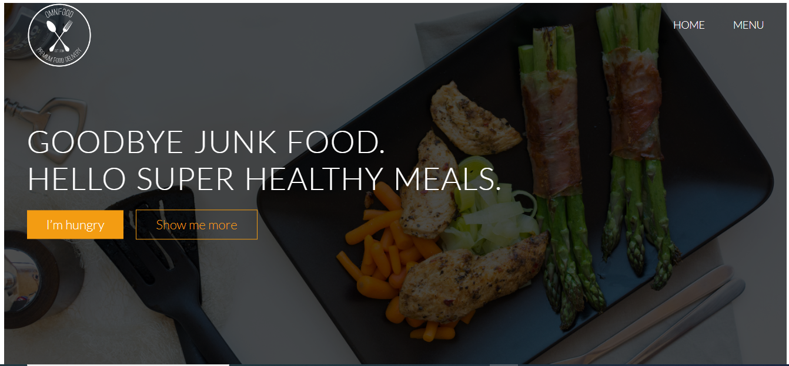
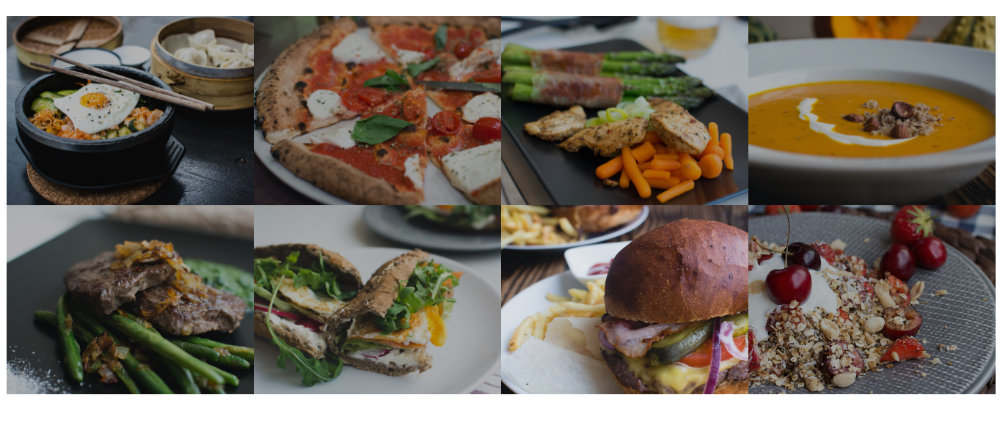

<!-- PROJECT SHIELDS -->
<!--
*** I'm using markdown "reference style" links for readability.
*** Reference links are enclosed in brackets [ ] instead of parentheses ( ).
*** See the bottom of this document for the declaration of the reference variables
*** for contributors-url, forks-url, etc. This is an optional, concise syntax you may use.
*** https://www.markdownguide.org/basic-syntax/#reference-style-links
-->
[![Contributors][contributors-shield]][contributors-url]
[![Forks][forks-shield]][forks-url]
[![Stargazers][stars-shield]][stars-url]
[![Issues][issues-shield]][issues-url]
[![MIT License][license-shield]][license-url]


<!-- PROJECT LOGO -->
<br />
<p align="center">
  <h3 align="center">Resturant page</h3>
  <p align="center">
   dynamically rendering a simple restaurant homepage! By the end, we are going to be using only JavaScript to generate the entire contents of the website!
    <br />
    <a href="https://github.com/collinsugwu/restaurant-page/blob/master/README.md"><strong>Explore the docs �</strong></a>
    <br />
    <br />
    <a href="https://www.theodinproject.com/courses/ruby-programming/lessons/advanced-building-blocks.">Assigment</a>
    �
    <a href="https://github.com/collinsugwu/restaurant-page/issues">Report Bug</a>
    �
    <a href="https://github.com/collinsugwu/restaurant-page/issues">Request Feature</a>
  </p>
</p>


<!-- TABLE OF CONTENTS -->
## Table of Contents

* [About the Project](#about-the-project)
  * [Built With](#built-with)
* [Getting Started](#getting-started)
  * [Prerequisites](#prerequisites)
  * [Installation](#installation)
* [Usage](#usage)
* [Roadmap](#roadmap)
* [Contributing](#contributing)
* [License](#license)
* [Contact](#contact)
* [Acknowledgements](#acknowledgements)


<!-- ABOUT THE PROJECT -->
## About The Project
Link to the [live](https://raw.githack.com/collinsugwu/restaurant-page/tree/ui-design) version

The main goal of this project is for the student to show the understanding of the benefits of modularized code as well as the ability to set up a javascript application made of different modules using webpack.

<!-- [![Product Name Screen Shot][product-screenshot]](https://example.com) -->
<p>Landing page</p>


<p>Menu page</p>


### Built With
This progam was made using this technologies
* [Javascript](https://developer.mozilla.org/en-US/docs/Web/JavaScript)
* eslint
* webpack
* HTML
* CSS


<!-- GETTING STARTED -->
## Getting Started

To get a local copy up and running follow these simple example steps.

### Installation

<!-- 1. Get a free API Key at [https://example.com](https://example.com) -->
1. Clone the repo
```sh
git clone https://github.com/collinsugwu/restaurant-page
```

<!-- USAGE EXAMPLES -->
## Usage
1. enter player's name
2. click on start game button
3. each player select a cell
4. the same symbol on all rows, columns or diagonal indicate winning


<!-- ROADMAP -->
## Roadmap

See the [open issues](https://github.com/collinsugwu/restaurant-page/issues) for a list of proposed features (and known issues).


<!-- CONTRIBUTING -->
## Contributing

Contributions are what make the open source community such an amazing place to be learn, inspire, and create. Any contributions you make are **greatly appreciated**.

1. Fork the Project
2. Create your Feature Branch (`git checkout -b feature/AmazingFeature`)
3. Commit your Changes (`git commit -m 'Add some AmazingFeature'`)
4. Push to the Branch (`git push origin feature/AmazingFeature`)
5. Open a Pull Request


<!-- LICENSE -->
## License

Distributed under the MIT License. See `LICENSE` for more information.


<!-- CONTACT -->
## Contact


* Collins Ugwu: [Github](https://github.com/collinsugwu), [Twitter](https://twitter.com/collinsugwu_me)

Project Link: [https://github.com/collinsugwu/restaurant-page](https://github.com/collinsugwu/restaurant-page)

<!-- ACKNOWLEDGEMENTS -->
## Acknowledgements
* [Microverse](https://www.microverse.org/)
* [The Odin Project](https://www.theodinproject.com/)


<!-- MARKDOWN LINKS & IMAGES -->
<!-- https://www.markdownguide.org/basic-syntax/#reference-style-links -->
[contributors-shield]: https://img.shields.io/github/contributors/collinsugwu/restaurant-page
[contributors-url]: https://github.com/collinsugwu/restaurant-page/graphs/contributors
[forks-shield]: https://img.shields.io/github/forks/collinsugwu/restaurant-page
[forks-url]: https://github.com/collinsugwu/restaurant-page/network/members
[stars-shield]: https://img.shields.io/github/stars/collinsugwu/restaurant-page
[stars-url]: https://github.com/collinsugwu/restaurant-page/stargazers
[issues-shield]: https://img.shields.io/github/issues/collinsugwu/restaurant-page
[issues-url]: https://github.com/collinsugwu/restaurant-page/issues
[license-shield]: https://img.shields.io/github/license/collinsugwu/restaurant-page
[license-url]: https://github.com/collinsugwu/restaurant-page/blob/master/LICENSE.txt

